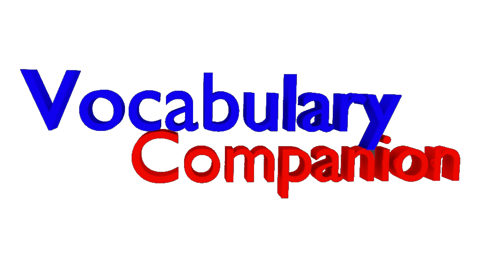

# VocabularyCompanion

A program which helps you to practise your vocabulary. It's a simple program with many different helpful features:

- create different users
- create different units in every user
- save your vocabulary
- save your statistics
- practise your vocabulary
- import users and units
- export users and units
- save your data by using localStorage
- import different plugins

Try it: 
<a href="https://htmlpreview.github.io/?https://github.com/mattes2008/VocabularyCompanion/blob/master/index.html">Online</a>
 | 
<a href="https://github.com/mattes2008/VocabularyCompanion/releases/tag/InternalVersion">Download</a>
